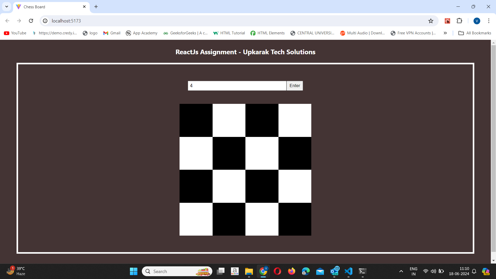

# ReactJs Assignment - Upkarak Tech Solutions

## Website Image and link



> link: https://upkaraktech-task.vercel.app/

## Prerequisites

Make sure you have the following installed before setting up the project:

- [Node.js v20.14.0](https://nodejs.org/en/) (or compatible version)
- [npm](https://www.npmjs.com/) or [yarn](https://yarnpkg.com/)
- VITE v5.3.1

## Installation

1.  Clone the repository:

```sh
git clone https://github.com/vaibhavk2474/upkaraktech-task.git
cd upkaraktech-task
```

2.  Install dependencies:

```sh
npm install
or
yarn install
```

3. start development server

```sh
npm run dev
or
yarn dev
```

4. After running the above command, you should see output similar to this:

```sh
> your-project@0.0.0 dev
> vite

  VITE v5.3.1  ready in 1037 ms

  ➜  Local:   http://localhost:5173/
  ➜  Network: use --host to expose
  ➜  press h + enter to show help
```

5. Open your web browser and navigate to the following URL to view the application:
   http://localhost:5173/
